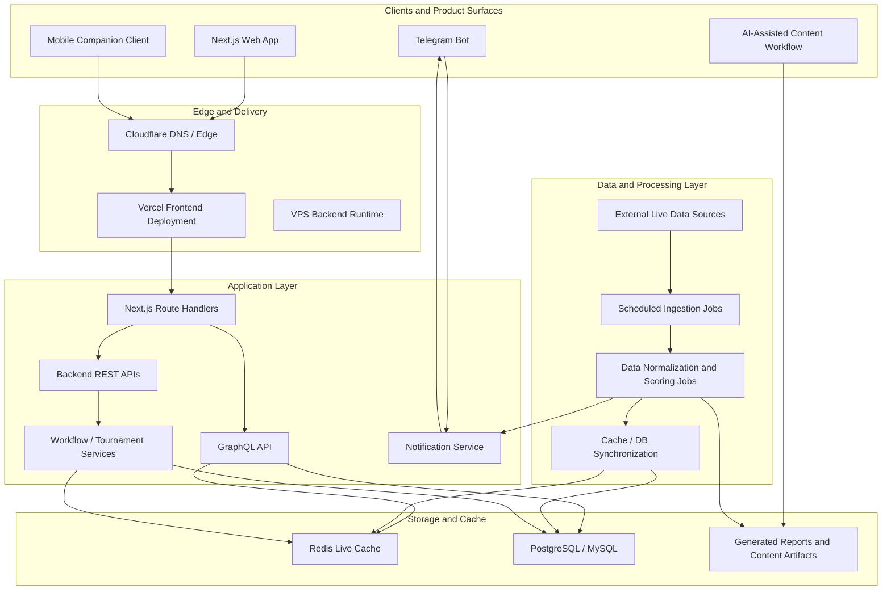

# LetLetMe

> Real-time analytics platform for live sports data, workflow automation, and multi-platform product delivery.

LetLetMe is a production full-stack SaaS system built around real-time data ingestion, analytics dashboards, workflow management, and automated content delivery. The platform combines a Next.js web application, REST and GraphQL APIs, scheduled data pipelines, Redis-backed live caching, relational databases, bot integrations, and a mobile companion client.

This repository is presented as a senior full-stack engineering case study: the focus is system ownership, backend reliability, realtime data synchronization, cloud deployment, and practical AI-assisted workflows.


## Product Snapshot

LetLetMe turns fast-moving external sports data into usable live dashboards, analytics views, tournament workflows, and automated notifications.

The product is designed for users who need current information without manually refreshing data sources, reconciling spreadsheet exports, or rebuilding reports by hand.

## Screenshot Layout

Use 3 to 5 screenshots maximum. Each image should be cropped around one clear product capability and paired with a short caption.

| Order | Screenshot | Purpose | Caption |
| --- | --- | --- | --- |
| 1 | Dashboard | Show the product as active operating software | Realtime dashboard for monitoring active data, key metrics, and user-facing product state. |
| 2 | Analytics / Stats | Show the data-heavy product surface | Analytics view built for fast comparison, data review, and decision support. |
| 3 | Workflow Management | Show backend workflow ownership through the UI | Workflow management surface for creating, validating, and tracking setup jobs. |
| 4 | Architecture | Show system depth without adding more UI noise | Production architecture across web, APIs, jobs, cache, database, notifications, and AI-assisted workflows. |
| 5 | Optional Mobile / Bot | Use only if polished and readable | Companion delivery channel for time-sensitive updates and lightweight product access. |

## Why This Project Matters

LetLetMe handles the product concerns common in real SaaS systems:

- Realtime user-facing data with explicit cache-control decisions
- Backend services that reconcile external data with internal product rules
- Scheduled ingestion and processing jobs
- Redis cache design for high-read live views
- REST and GraphQL API boundaries
- Relational persistence for durable product state
- Multi-platform clients across web, bot, and mobile
- Cloud deployment through Vercel, Cloudflare, VPS services, and CI/CD
- AI-assisted content and notification workflows

## Architecture



## Engineering Highlights

### Realtime Analytics

The platform exposes live data through frontend views backed by GraphQL and Redis. Realtime pages are designed around freshness, explicit no-cache behavior, and predictable refresh cycles instead of relying on stale browser or CDN state.

### Backend Ownership

LetLetMe includes backend services for data ingestion, scoring, tournament setup, cache rebuilds, API routing, and operational recovery. The system separates user-facing query APIs from background processing jobs while keeping shared business logic consistent.

### Data Synchronization

External data is normalized, stored, cached, and revalidated across Redis and relational databases. The system is designed to detect and repair drift between cache and source-of-truth records.

### Workflow Management

Tournament and setup flows are treated as backend workflows, not just frontend forms. Creation, validation, queueing, status tracking, and repair paths are part of the product architecture.

### Multi-Platform Delivery

The same platform supports a web application, mobile companion client, Telegram notifications, and generated content workflows. This creates a realistic SaaS surface area across product, operations, and user communication.

### Cloud Deployment

The project uses a practical deployment mix: Vercel for frontend delivery, Cloudflare for edge/DNS, VPS-hosted backend services, GitHub Actions for CI/CD, and runtime services for jobs, cache, and API processes.

### AI-Assisted Workflows

AI is used as part of the operating workflow for content generation, data summaries, release support, and notification preparation. The emphasis is not on adding a chatbot for novelty, but on improving real product operations.

## Technical Scope

| Area | Implementation |
| --- | --- |
| Frontend | Next.js, server/client rendering boundaries, public and authenticated product views |
| APIs | REST endpoints, GraphQL queries and mutations, route handlers |
| Data | PostgreSQL/MySQL, Redis cache, normalized domain records |
| Processing | Scheduled jobs, data ingestion, scoring, synchronization, repair workflows |
| Integrations | Telegram bot delivery, mobile companion client, external live-data APIs |
| Deployment | Vercel, Cloudflare, VPS services, Dockerized backend runtime, GitHub Actions |
| Operations | Cache verification, backend job reruns, production smoke checks, API documentation |

## Case Study Focus

This repository demonstrates:

- End-to-end product engineering from UI to database
- Realtime system design under changing external data
- Practical backend architecture for workflows and jobs
- Production deployment and operational debugging
- Multi-platform product delivery
- AI-assisted development and content operations

## Screenshot Plan

Use only 3 to 5 images in the repository README.

1. **Dashboard**: first image, cropped to the main product workspace. Show the product as useful software, not as a landing page.
2. **Analytics / Stats**: second image, focused on tables, rankings, filters, or live comparisons.
3. **Workflow Management**: third image, showing tournament setup, job status, validation, or management UI.
4. **Architecture Diagram**: fourth image, exported from the Mermaid diagram or shown directly in the README.
5. **Optional Mobile / Bot Surface**: only include if the screenshot is polished and reinforces multi-platform delivery.

Avoid long full-page screenshots, tiny unreadable mobile captures, or screens dominated by game-specific terminology. Crop each screenshot around one clear product capability.

## Recommended Screenshot Captions

- **Dashboard**: "Realtime dashboard for monitoring active data, key metrics, and product state."
- **Analytics**: "Analytics view for comparing live and historical performance data."
- **Workflow Management**: "Workflow management surface for setup, validation, and background job tracking."
- **Architecture**: "Production architecture across frontend, APIs, jobs, cache, database, and notifications."
- **Mobile / Bot**: "Companion delivery channel for time-sensitive updates and lightweight product access."

## Suggested Repository Structure

```text
.
├── README.md
├── assets/
│   └── screenshots/
│       ├── dashboard.png
│       ├── analytics.png
│       ├── workflow-management.png
│       └── architecture.png
├── docs/
│   ├── architecture.md
│   ├── api-overview.md
│   └── operations.md
└── src/
```

## Optional README Sections

Add these only if the repository contains enough supporting detail:

- **Live Demo**: link to the production web app if it is safe and polished.
- **API Overview**: summarize key REST and GraphQL surfaces without listing every endpoint in the README.
- **Operational Notes**: describe cache rebuilds, job reruns, and deployment checks at a high level.
- **Selected Engineering Decisions**: explain 3 to 5 decisions, such as Redis for live reads or GraphQL for frontend aggregation.
- **Roadmap**: keep it short and client-friendly. Avoid turning it into a backlog dump.

## GitHub Pin Presentation

Use a pinned repository description like:

> Real-time SaaS analytics platform with Next.js, GraphQL, REST APIs, Redis caching, scheduled data pipelines, bot integrations, and cloud deployment.

Recommended topics:

```text
nextjs graphql redis postgresql realtime-analytics saas backend-engineering data-pipelines vercel cloudflare
```

For the repository social preview image, use a clean composition with:

- Product name: **LetLetMe**
- Subtitle: **Realtime Analytics Platform**
- Three short labels: **Live Data**, **Workflow Automation**, **Multi-Platform Delivery**
- Background: cropped dashboard or architecture visual, not a generic gradient

## Positioning Notes

Use "sports analytics" or "live data platform" language in public-facing copy. Keep domain-specific terms inside screenshots or feature examples, but do not make them the headline. The value proposition should read as production engineering: realtime data, reliable workflows, cloud deployment, and end-to-end ownership.
