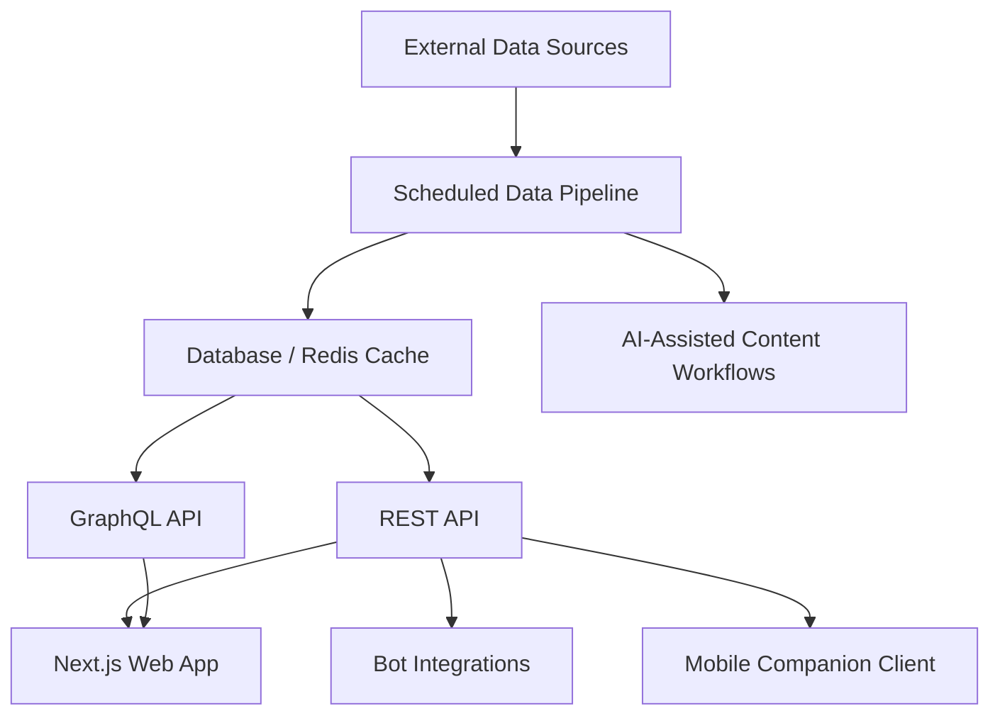

# LetLetMe — Real-Time Analytics Platform

Live site: [letletme.top](https://letletme.top)

LetLetMe is a real-time analytics platform with web frontend, backend APIs, data processing, caching, GraphQL API, bot integrations, and AI-assisted workflows.

This case study summarizes the engineering architecture and delivery scope behind the system.

## My Role

I designed, built, and maintained the system end-to-end, including:

- Web frontend
- Backend REST APIs
- GraphQL API
- Data ingestion and processing pipeline
- Database schema and caching strategy
- Bot and notification workflows
- Cloud deployment and DNS setup
- AI-assisted content workflows

## System Overview

```text
External Data Sources
        ↓
Scheduled Data Pipeline
        ↓
Database / Redis Cache
        ↓
REST API / GraphQL API
        ↓
Web App / Bot Integrations / Mobile Client
```



## Key Engineering Areas

### Frontend Application

Built a modern web application using Next.js, React, TypeScript, TailwindCSS, and shadcn/ui.

The frontend includes dashboards, live data pages, statistics views, tournament management, authentication, and user profile features.

### Backend APIs

Built backend API services using Bun, Elysia.js, Drizzle ORM, Redis, structured logging, tests, and API documentation.

### Data Processing

Designed automated data synchronization and transformation workflows to support analytics, rankings, live updates, and historical data views.

### Multi-Platform Integration

The system integrates a web application, GraphQL API, Telegram bot, and mobile companion client.

### AI-Assisted Workflows

Added AI-assisted workflows for content generation, summaries, and publishing support.

## Tech Stack

| Area | Technologies |
|---|---|
| Frontend | Next.js, React, TypeScript, TailwindCSS, shadcn/ui |
| Backend | Bun, Elysia.js, REST APIs, GraphQL |
| Data | MySQL / PostgreSQL, Redis, Drizzle ORM |
| Infrastructure | Vercel, Cloudflare, scheduled jobs |
| Integrations | Telegram bot, mobile companion client, AI-assisted workflows |

## Related Repositories

| Component | Repository |
|---|---|
| Web Frontend | [tonglam/letletme-web](https://github.com/tonglam/letletme-web) |
| REST API | [tonglam/letletme-api](https://github.com/tonglam/letletme-api) |
| Data Processing Pipeline | [tonglam/letletme_data](https://github.com/tonglam/letletme_data) |
| GraphQL API | [tonglam/letletme-graphql](https://github.com/tonglam/letletme-graphql) |
| Telegram Bot | [tonglam/letletme-telegram-bot](https://github.com/tonglam/letletme-telegram-bot) |

## Screenshots

Screenshots will be added here:

1. Dashboard / homepage
2. Live data or statistics page
3. Tournament or user workflow page
4. Architecture diagram
5. Mobile companion client, if suitable

## Notes

Some implementation details, credentials, and environment configuration are omitted for security and maintainability reasons.
