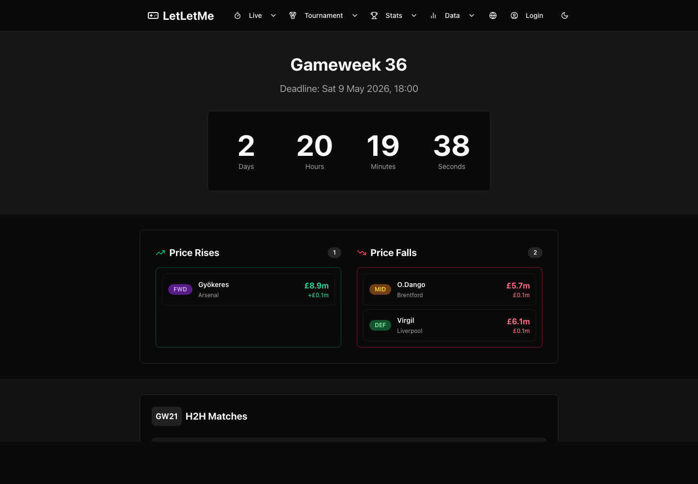
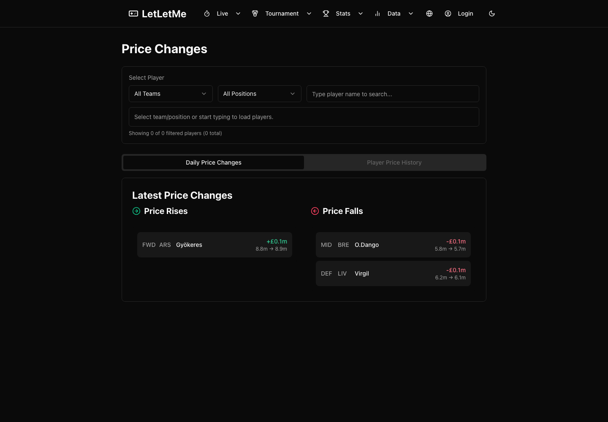
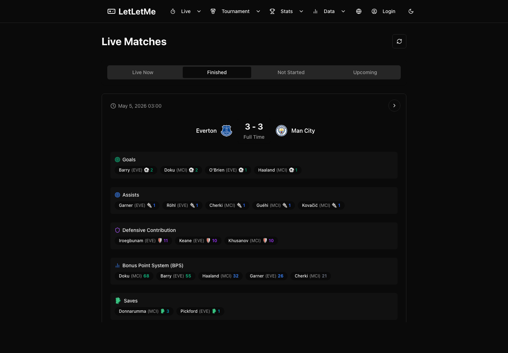
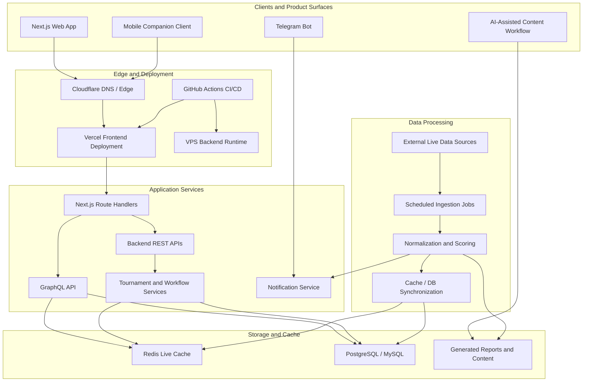

# LetLetMe

> Real-time sports analytics platform with web, APIs, data pipelines, Redis caching, bot delivery, and AI-assisted workflows.

Live product: [letletme.top](https://letletme.top)

## Purpose

This repository is a professional engineering case study for LetLetMe. It is written for clients, founders, and product owners who need to understand the scope and quality of the work without reading the full production codebase.

The goal is to show senior full-stack ownership: realtime product surfaces, backend workflow design, data synchronization, cloud deployment, and practical AI-assisted operations.

## Product Overview

LetLetMe turns fast-moving external sports data into live dashboards, analytics views, tournament workflows, automated notifications, and companion client experiences.

The system is not just a content site. It is a multi-platform SaaS-style application with:

- Next.js web frontend
- REST and GraphQL APIs
- Scheduled data ingestion and processing jobs
- Redis-backed realtime cache
- Relational storage with PostgreSQL/MySQL
- Telegram bot delivery
- Mobile companion client
- Cloudflare, Vercel, VPS services, Docker, and GitHub Actions
- AI-assisted content and operating workflows

## Screenshots

*Realtime dashboard for deadline monitoring, price movement, matchup status, and live product state.*

*Analytics surface for reviewing daily market movement and historical player value changes.*

*Live match breakdown with goals, assists, defensive actions, bonus indicators, and refreshable event state.*

## Architecture

## Engineering Highlights

### Realtime Analytics

Live product views are backed by GraphQL and Redis so users can inspect current data without waiting for slow page-level recomputation. Freshness-sensitive routes use explicit cache-control decisions and predictable refresh behavior.

### Backend Engineering

The backend owns data ingestion, scoring, workflow setup, cache rebuilds, API routing, and operational recovery paths. User-facing APIs are separated from background processing jobs while shared business rules remain consistent.

### Data Synchronization

External data is normalized, persisted, cached, and revalidated across Redis and relational databases. The system includes practical recovery flows for detecting and repairing drift between cache and source-of-truth records.

### Workflow Management

Tournament setup is treated as a backend workflow, not just a form submission. Creation, validation, queueing, status tracking, setup repair, and derived-data generation are part of the product architecture.

### Multi-Platform Delivery

The platform supports a web application, mobile companion client, Telegram notifications, and generated content workflows. This gives the system realistic SaaS surface area across product, operations, and communication.

### Cloud Deployment

LetLetMe uses Vercel and Cloudflare for the frontend and edge layer, VPS-hosted backend services for long-running workloads, Dockerized runtime processes, and GitHub Actions for automated deployment.

### AI-Assisted Operations

AI is used for content support, data summaries, workflow preparation, and notification assistance. The value is operational leverage around a real product system, not a standalone chatbot feature.

## Technical Scope

| Area | Implementation |
| --- | --- |
| Frontend | Next.js, React, server/client rendering, public and authenticated product views |
| APIs | REST services, GraphQL API, Next.js route handlers |
| Data | PostgreSQL/MySQL, Redis cache, normalized domain records |
| Processing | Scheduled jobs, data ingestion, scoring, cache/database synchronization |
| Workflows | Tournament creation, setup status, queueing, repair, derived data generation |
| Integrations | Telegram bot, mobile companion client, external live-data APIs |
| Deployment | Vercel, Cloudflare, VPS services, Docker, GitHub Actions |
| Operations | Cache verification, job reruns, production smoke checks, API documentation |

## Related Repositories

| Component | Repository |
| --- | --- |
| Web Frontend | [tonglam/letletme-web](https://github.com/tonglam/letletme-web) |
| REST API / Data Jobs | [tonglam/letletme_data](https://github.com/tonglam/letletme_data) |
| GraphQL API | [tonglam/letletme-graphql](https://github.com/tonglam/letletme-graphql) |
| Telegram Bot | [tonglam/letletme-telegram-bot](https://github.com/tonglam/letletme-telegram-bot) |
| Mobile Companion Client | [tonglam/letletme-wechat-miniprogram](https://github.com/tonglam/letletme-wechat-miniprogram) |

## Case Study Takeaways

- Built and operated a production full-stack application end to end
- Designed realtime reads around Redis, GraphQL, and explicit cache behavior
- Implemented backend workflows for data-heavy product operations
- Integrated multiple client surfaces and notification channels
- Managed cloud deployment across frontend, edge, backend, jobs, and CI/CD
- Used AI-assisted workflows where they improve real operating speed

## Positioning

LetLetMe is best understood as a realtime analytics and workflow platform. The sports domain provides the data source and product context; the engineering value is in the full-stack architecture, data synchronization, cloud deployment, realtime behavior, and operational ownership.
